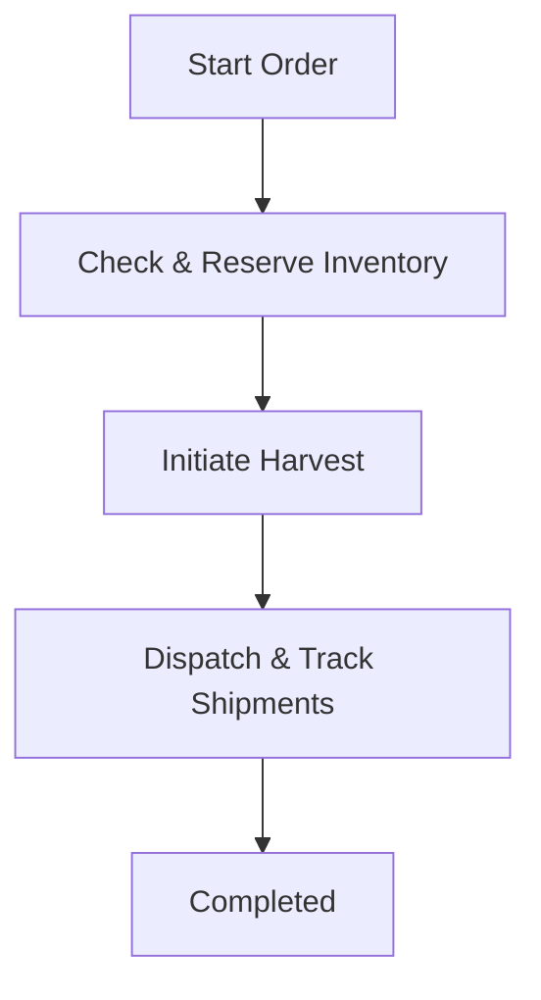

# basic-event-driven-data-pipeline

### What is the main goal of this pipeline, and which critical problem does it solve?
- To reliably process crop orders end-to-end for a farm producer—managing inventory checks, harvesting, packing, payments, and shipping—while ensuring resilience through retry logic, interruption recovery, and safe resumption of failed steps without data loss.

### Why is an event-driven approach suitable for this use case, and how does it benefit your objectives over traditional batch methods?
- An event-driven approach enables real-time coordination across departments, reducing delays, accelerating order fulfillment, and improving responsiveness compared to slower, less flexible batch methods.

### How will data be sourced, validated, and transformed to ensure consistency and reliability?
- TBD

### What metrics or tests define a robust pipeline, and how will you confirm its resilience?
- TBD

**1. Overview**  
We need a reliable, end-to-end workflow to process crop orders for a farm producer. This includes checking and reserving inventory, coordinating harvesting, and shipping. Each step needs its own indmenpotent system and a worflow engine for durable execution.

**2. Requirements**  
- Inventory checks.
- Seamless task orchestration for harvesting and packing.
- Shipping integration with retries for carrier bookings or label generation.
- State persistence in a reliable data store for restart and rollback.

**3. Architecture**  
Adopt a workflow engine that captures each step’s status. Store workflow state in a transactional database or message queue, ensuring durability. Each step is represented as a microservice or function, communicating via events or a central coordinator that supervises transitions and retries.

**4. Workflow**  
- **Inventory Checks**: Confirm SKU availability and lock quantities to avoid overcommitting. 
- **Harvesting**: Assign harvest tasks with trackable IDs.  
- **Shipping**: Request carrier or shipping service-. On failure, retry or switch to a backup carrier. Generate and store tracking labels. Confirm final pickup date and store shipping info.

**5. Resilience and Recovery**  
Persist each step’s state (e.g., “Harvesting in progress,” “Payment complete”) in a central datastore. On any interruption, the system checks the last confirmed step and resumes from there. Retry logic is built in for transient issues, and rollback paths ensure partial work can be undone if needed.

**6. Edge Cases**  
Examples include payment gateway errors, inventory overbooking, or shipping API timeouts. In each scenario, log details, notify relevant parties, and either retry or gracefully fail, ensuring no double charges or lost updates.

**7. Conclusion**  
This design ensures an orchestrated, resilient process for farm orders. By structuring each step around stateful transitions, retries, and reliable data storage, we maintain data integrity, handle unexpected failures, and fulfill orders consistently with minimal downtime.